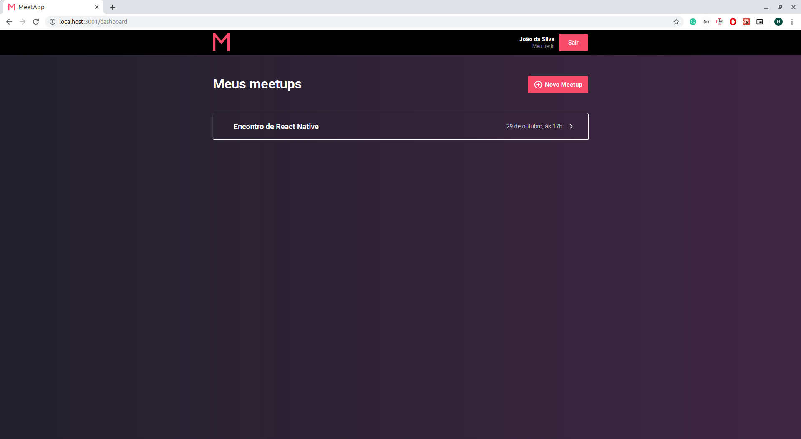
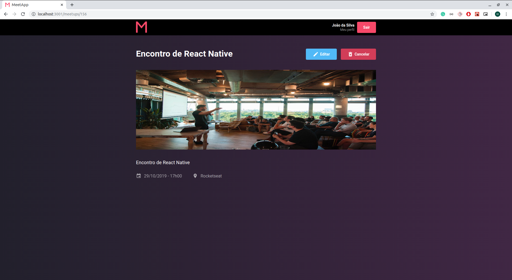

# MeetApp

Meetapp is a service used to organize events for people with similar interests.

# Web

# Mobile

# How to run

## Backend

`cd backend && yarn && yarn dev`

## Web

`cd web && yarn && yarn start`

## Mobile

`cd mobile && yarn && react-native run-android`
